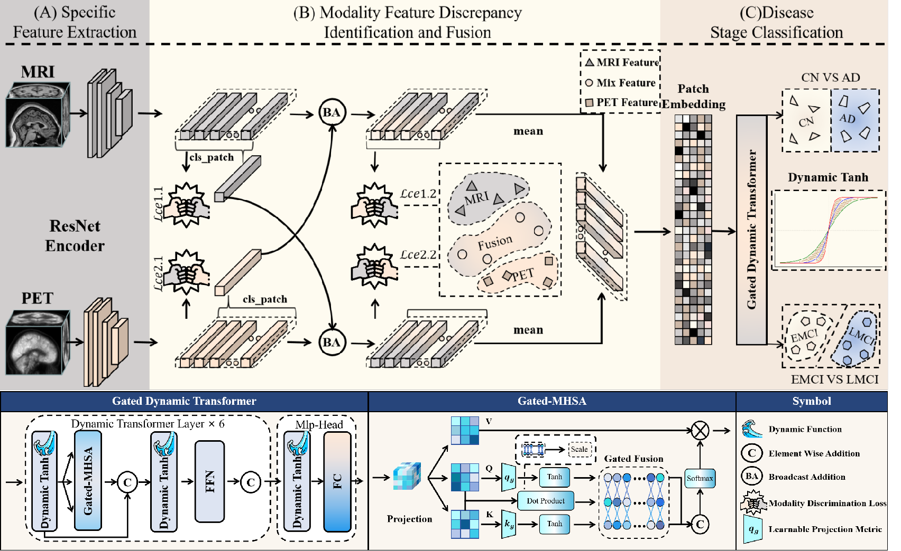

# MAG_ADNet
This repository is the official implementation of MAG-ADNet. 
# <Project Name>  <!-- 例：MAG_ADNet -->

> <基于多模态的AD和MCI亚种诊断>

[Paper](<link or "TBA">) • [Project Page](<optional>) • [License](#license)

---

## ✨ Model Structure

<p align="center">
  
</p>

---

## 💡 Features
- 多模态支持：MRI / PET
- <核心方法/模块>（ResNet-50 、 Modality Feature Discrepancy Identification and Fusion (MDIF) 、 Dynamic Tanh 、 Gated Multi-Head Self Attention (GMHSA)）
- 复现实验脚本与配置

---

## 🧠 Interpretability

<p align="center">
  
</p>

<p align="center">
  <em>Example: Occlusion heatmap showing the key brain regions the model focuses on in MRI / PET.</em>
</p>

---

## 📂 Dataset Structure
We employed the baseline FDG-PET and T1-weighted MRI data, preprocessed and provided by the [Alzheimer’s Disease Neuroimaging Initiative (ADNI)](https://adni.loni.usc.edu/)
 database.
The dataset should be organized in the following format:

```text
├── mri                             # MRI images
│   ├── train
│   │   ├── AD    # Alzheimer's Disease
│   │   ├── MCI   # Mild Cognitive Impairment
│   │   ├── EMCI  # Early MCI
│   │   └── LMCI  # Late MCI
│   └── test
│       ├── AD
│       ├── MCI
│       ├── EMCI
│       └── LMCI
│
├── pet                             # PET images
│   ├── train
│   │   ├── AD
│   │   ├── MCI
│   │   ├── EMCI
│   │   └── LMCI
│   └── test
│       ├── AD
│       ├── MCI
│       ├── EMCI
│       └── LMCI
│


- `mri/` : contains structural MRI scans in NIfTI format (`.nii.gz`).  
- `pet/` : contains corresponding PET scans in NIfTI format (`.nii.gz`).  
```
---

## 📦 Environment
- Python <3.12.4>
- PyTorch >= <2.4.0>

"Quickstart: Create an Environment (Example)"：
```bash
conda create -n <env_name> python=3.9 -y
conda activate <env_name>
pip install -r requirements.txt
```

---

## 🏋️‍♂️ Train & Test

To train and evaluate the model, simply run:

```bash
python main.py
```

---

## 📊 Results
<h2 style="color:blue;">**Comparative Experiment**</h2>
<table>
  <tr>
    <th rowspan="2">Method</th>
    <th colspan="6" style="text-align:center;">AD vs CN</th>
    <th colspan="6" style="text-align:center;">LMCI vs EMCI</th>
  </tr>
  <tr>
    <th>Accuracy</th>
    <th>Precision</th>
    <th>Recall</th>
    <th>F1</th>
    <th>Specificity</th>
    <th>AUC</th>
    <th>Accuracy</th>
    <th>Precision</th>
    <th>Recall</th>
    <th>F1</th>
    <th>Specificity</th>
    <th>AUC</th>
  </tr>
  <tr>
    <td>Miccai-Fusion</td>
    <td>85.2</td><td>84.7</td><td>83.9</td><td>84.3</td><td>86.0</td><td>0.89</td>
    <td>78.4</td><td>77.9</td><td>76.5</td><td>77.2</td><td>79.0</td><td>0.82</td>
  </tr>
  <tr>
    <td>ADViT</td>
    <td>89.5</td><td>90.1</td><td>88.6</td><td>89.3</td><td>90.4</td><td>0.92</td>
    <td>83.6</td><td>84.1</td><td>82.7</td><td>83.4</td><td>84.5</td><td>0.87</td>
  </tr>
  <tr>
    <td>Transmf_AD</td>
    <td>87.8</td><td>87.2</td><td>86.1</td><td>86.6</td><td>88.0</td><td>0.90</td>
    <td>80.2</td><td>81.0</td><td>79.4</td><td>80.2</td><td>81.6</td><td>0.84</td>
  </tr>
  <tr>
    <td>MENet</td>
    <td>90.3</td><td>90.7</td><td>89.1</td><td>89.9</td><td>91.0</td><td>0.93</td>
    <td>85.0</td><td>85.6</td><td>84.3</td><td>84.9</td><td>85.8</td><td>0.88</td>
  </tr>
  <tr>
    <td>Diamond</td>
    <td>91.1</td><td>91.5</td><td>90.4</td><td>90.9</td><td>91.8</td><td>0.94</td>
    <td>86.4</td><td>86.9</td><td>85.7</td><td>86.3</td><td>87.2</td><td>0.89</td>
  </tr>
  <tr>
    <td><b>Ours</b></td>
    <td><b>92.7</b></td><td><b>92.3</b></td><td><b>91.8</b></td><td><b>92.0</b></td><td><b>93.1</b></td><td><b>0.95</b></td>
    <td><b>88.9</b></td><td><b>89.2</b></td><td><b>88.1</b></td><td><b>88.6</b></td><td><b>89.7</b></td><td><b>0.91</b></td>
  </tr>
</table>

---

<h2 style="color:blue;">**Ablation Experiment**</h2>
<table>
  <tr>
    <th rowspan="2">Method</th>
    <th colspan="6" style="text-align:center;">AD vs CN</th>
    <th colspan="6" style="text-align:center;">LMCI vs EMCI</th>
  </tr>
  <tr>
    <th>Accuracy</th>
    <th>Precision</th>
    <th>Recall</th>
    <th>F1</th>
    <th>Specificity</th>
    <th>AUC</th>
    <th>Accuracy</th>
    <th>Precision</th>
    <th>Recall</th>
    <th>F1</th>
    <th>Specificity</th>
    <th>AUC</th>
  </tr>
  <tr>
    <td>Ours (w/o PET)</td>
    <td>85.2</td><td>84.7</td><td>83.9</td><td>84.3</td><td>86.0</td><td>0.89</td>
    <td>78.4</td><td>77.9</td><td>76.5</td><td>77.2</td><td>79.0</td><td>0.82</td>
  </tr>
  <tr>
    <td>Ours (w/o MRI)</td>
    <td>89.5</td><td>90.1</td><td>88.6</td><td>89.3</td><td>90.4</td><td>0.92</td>
    <td>83.6</td><td>84.1</td><td>82.7</td><td>83.4</td><td>84.5</td><td>0.87</td>
  </tr>
  <tr>
    <td>Ours (w/o MDIF)</td>
    <td>87.8</td><td>87.2</td><td>86.1</td><td>86.6</td><td>88.0</td><td>0.90</td>
    <td>80.2</td><td>81.0</td><td>79.4</td><td>80.2</td><td>81.6</td><td>0.84</td>
  </tr>
  <tr>
    <td>Ours (w/o DyT)</td>
    <td>90.3</td><td>90.7</td><td>89.1</td><td>89.9</td><td>91.0</td><td>0.93</td>
    <td>85.0</td><td>85.6</td><td>84.3</td><td>84.9</td><td>85.8</td><td>0.88</td>
  </tr>
  <tr>
    <td>Ours (w/o GMHSA)</td>
    <td>91.1</td><td>91.5</td><td>90.4</td><td>90.9</td><td>91.8</td><td>0.94</td>
    <td>86.4</td><td>86.9</td><td>85.7</td><td>86.3</td><td>87.2</td><td>0.89</td>
  </tr>
  <tr>
    <td><b>Ours</b></td>
    <td><b>92.7</b></td><td><b>92.3</b></td><td><b>91.8</b></td><td><b>92.0</b></td><td><b>93.1</b></td><td><b>0.95</b></td>
    <td><b>88.9</b></td><td><b>89.2</b></td><td><b>88.1</b></td><td><b>88.6</b></td><td><b>89.7</b></td><td><b>0.91</b></td>
  </tr>
</table>


